**Home Work \#1 **

***Part A:***

**Note:** The images shown in this file does not correspond to their
original dimensions (height × width), please refer to the submitted
files for dimensions cross-check. All the results presented here are
achieved through zero padding, by using the padding concept explained in
Tensor flow help.

***Image\_1 (1280 × 720)***

-   Number of operations for Task1 = 48,844,800

-   Number of operations for Task2 = 274,636,800

-   Number of operations for Task3 = 36,633,600

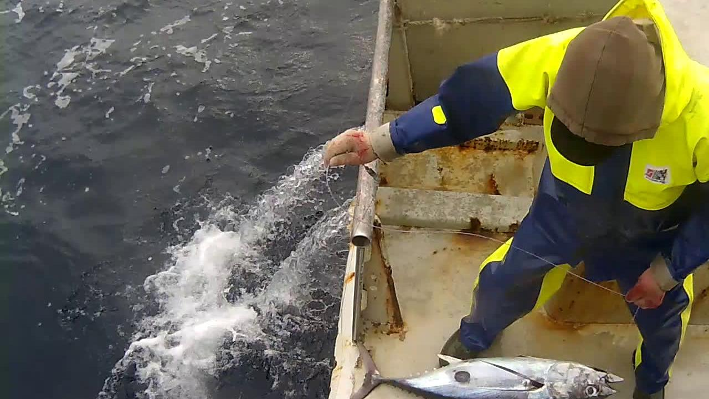{width="6.489583333333333in" height="3.65625in"}

**Image\_1 (1280 × 720)**

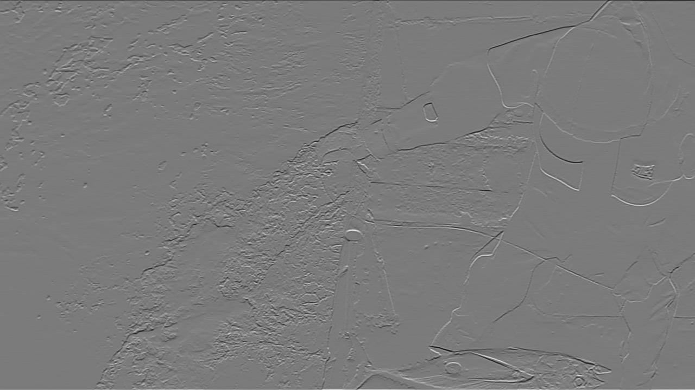{width="6.489583333333333in" height="3.65625in"}

**Image\_1 processed with parameters of Task \# 1 (Kernel \# 1)**

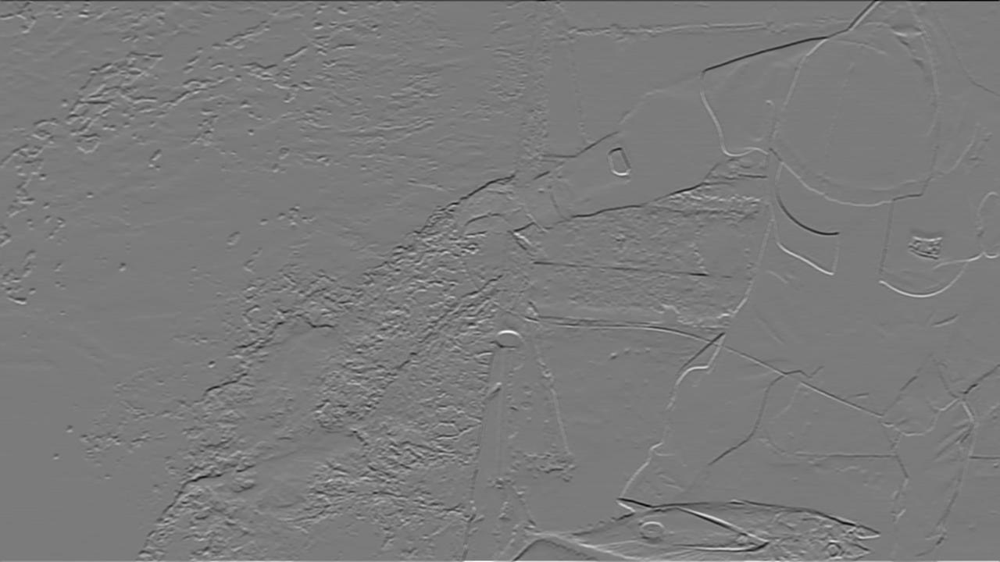{width="6.489583333333333in" height="3.65625in"}

**Image\_1 processed with parameters of Task \# 2 (Kernel \# 4)**

{width="6.489583333333333in" height="3.65625in"}

**Image\_1 processed with parameters of Task \# 2 (Kernel \# 5)**

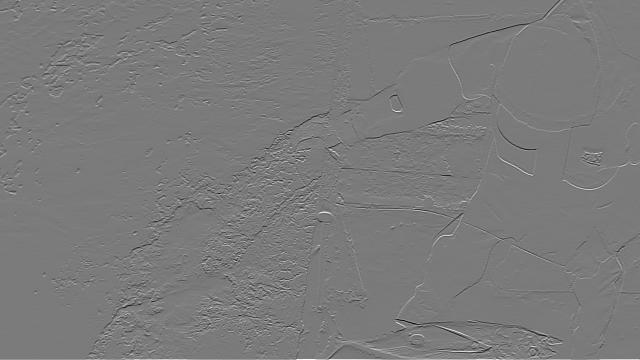{width="6.5in" height="3.65625in"}

**Image\_1 processed with parameters of Task \# 3 (Kernel\#1)**

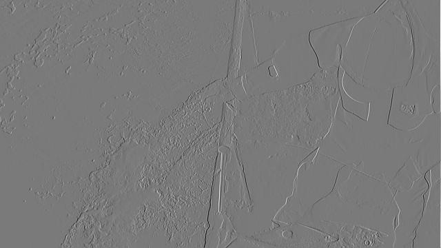{width="6.5in" height="3.65625in"}

**Image\_1 processed with parameters of Task \# 3 (Kernel\#2)**

{width="6.5in" height="3.65625in"}

**Image\_1 processed with parameters of Task \# 3 (Kernel\#3)**

***Image\_2 (1920 × 1080)***

-   Number of operations for Task1 = 109,900,800

-   Number of operations for Task2 = 617,932,800

-   Number of operations for Task3 = 82,425,600

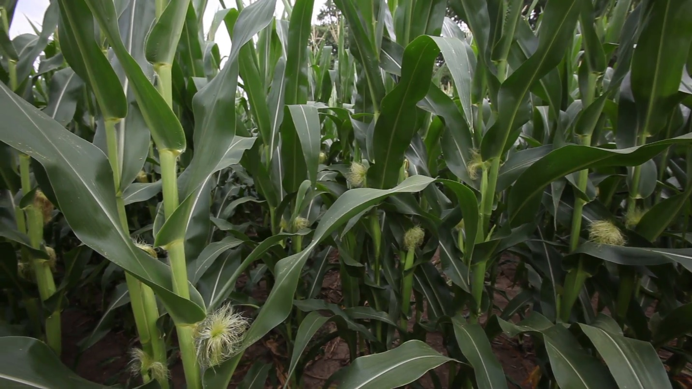{width="6.5in" height="3.65625in"}

**Image\_2 (1920 × 1080)**

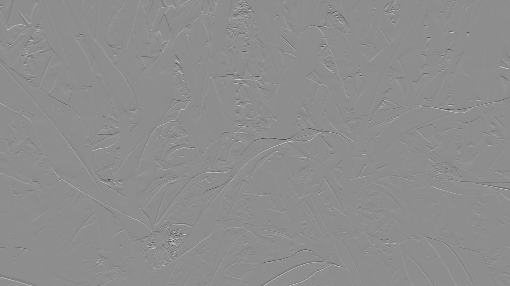{width="6.5in" height="3.65625in"}

**Image\_2 processed with parameters of Task \# 1 (Kernel\#1)**

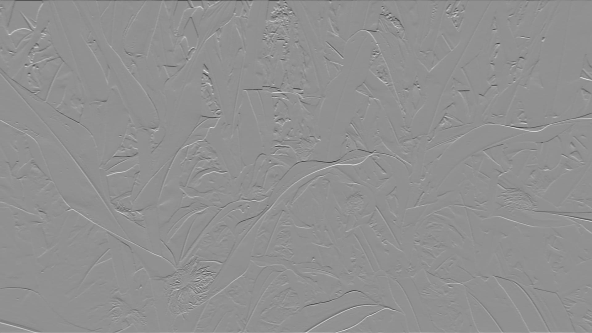{width="6.5in" height="3.65625in"}

**Image\_2 processed with parameters of Task \# 2 (Kernel\#4)**

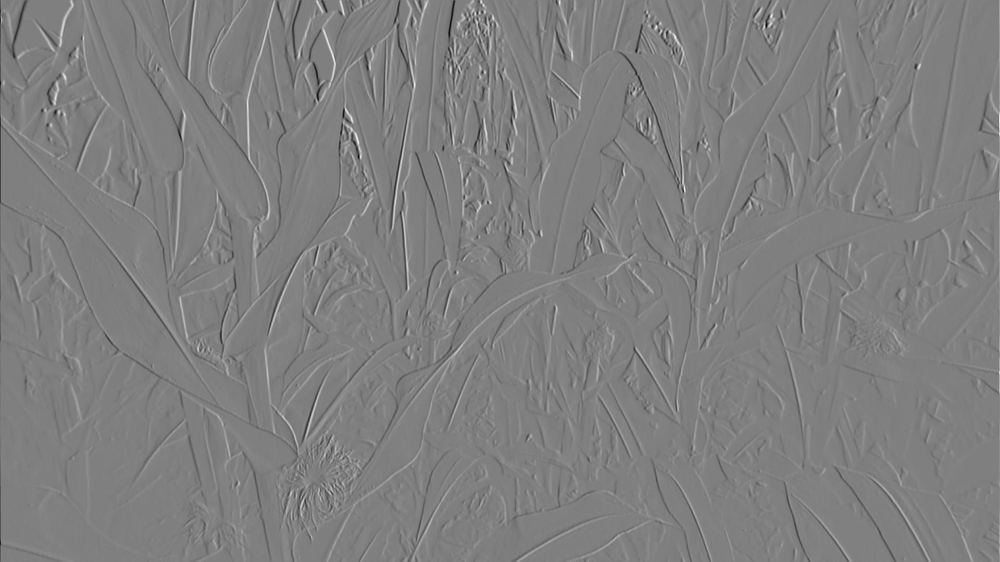{width="6.5in" height="3.65625in"}

**Image\_2 processed with parameters of Task \# 2 (Kernel\#5)**

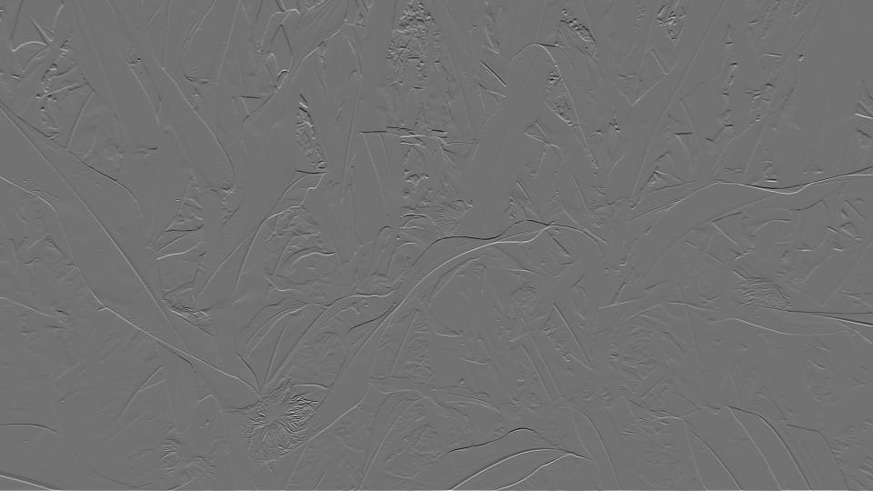{width="6.5in" height="3.65625in"}

**Image\_2 processed with parameters of Task \# 3 (Kernel\#1)**

{width="6.5in" height="3.65625in"}

**Image\_2 processed with parameters of Task \# 3 (Kernel\#2)**

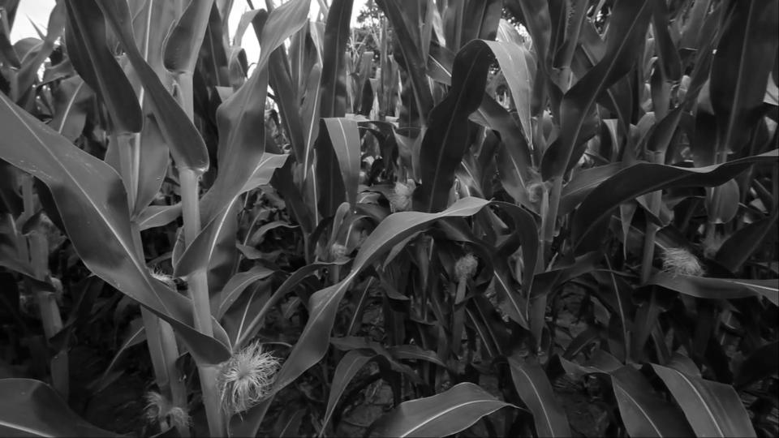{width="6.5in" height="3.65625in"}

**Image\_2 processed with parameters of Task \# 3 (Kernel\#3)**

***Part B:***

**Note:** These are actual results and are not extrapolate for the
increased number of out\_channels. These results were achieved using
Intel® Core™ i7 7800X CPU with 64 GB DDR4 RAM (2400MHz) on desktop
machine.

[\[CHART\]]{.chart}

**Time taken by forward function as a function of (i) to process the
Image\_1 (1280 × 720)**

[\[CHART\]]{.chart}

**Time taken by forward function as a function of (i) to process the
Image\_2 (1920 × 1080)**

***Part C:***

**Note:** These are actual results and are not extrapolate for the
increased kernel size. These results were achieved using Intel® Core™ i7
7800X CPU with 64 GB DDR4 RAM (2400MHz) on desktop machine.

[\[CHART\]]{.chart}

**Number of operations performed for convolution as a function of kernel
size for Image\_1 (1280 × 720)**

[\[CHART\]]{.chart}

**Number of operations performed for convolution as a function of kernel
size for Image\_2 (1920 × 1080)**
