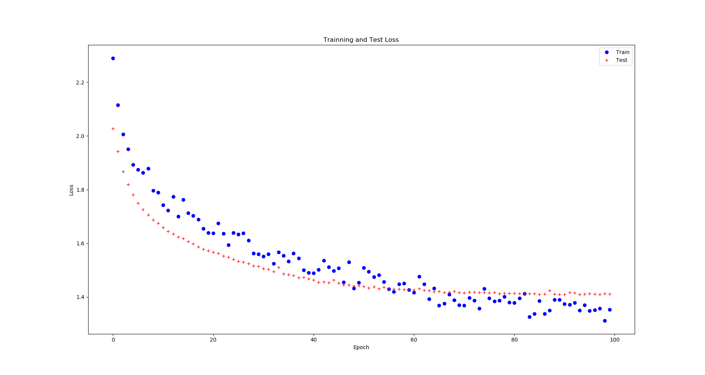
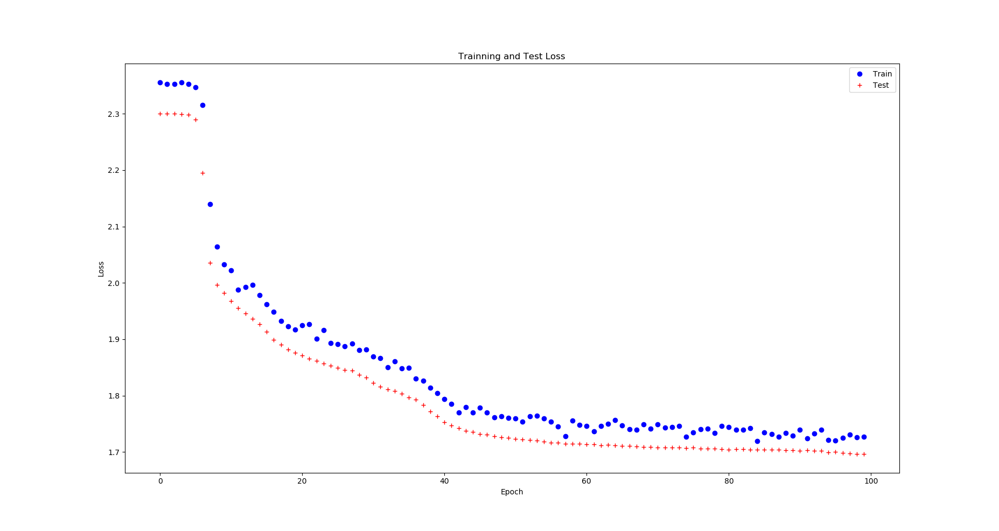

**Home Work \#5 **

***Note:*** There are **6 python files** along with this file. Each API
uses 3 files (network definition, network training, and test script) for
executing the code. Read the API details below for more details.

***API (img2num)***

The LeNet5 architecture was implemented using the pytorch library for
training on MNIST dataset. The network was defined in the
‘**LeNet5.py**’ file and training procedure was carried out in the
‘**im2num.py**’. The training script contains the two functions,
‘**train**’ and ‘**forward**’. The forward function uses a pytorch
standard 3D tensor as an input and passes it through the network to
predict it. As MNIST dataset contains gray scale images, therefore
‘**forward**’ also only accepts the gray scale image tensor. Convert the
image to gray scale image and then change it to the pytorch tensor
before passing it to the ‘**forward**’ function. The dimension input
tensor should be 28 × 28 (H × W). The ‘**test\_nn2num.py**’ script runs
a test by calling and executing the train function. The test script also
shows how to correctly convert an image to grayscale and create a tensor
for passing it to the ‘**forward**’ function. The epochs are set to only
1 currently, therefore the test script runs the entire training process
for only 1 epoch. This test script is just a sanity check/demo script.

**Comparison of LenNet5 and Fully connected net: **

The following comparison is carried out for **100 epochs,
CrossEntropyLoss** function.

  **MNIST data set**
  ------------------------------- ----------------------------------------------------------------------------------------------------------------------------------------------------------------------------------------- -------------------------------------------------------------------------
                                  LeNet5                                                                                                                                                                                    Fully connected net
  Training Time (minutes)         24.9512                                                                                                                                                                                   8.5881
  Inference Time (milliseconds)   0.36168                                                                                                                                                                                   0.1893
  Convergence                     Net is still learning, however, we can say that it starts to converge after 60 epochs. But error is still decreasing and net can achieve a better solution, if trained for longer time.   Net is still not converged at 100 epochs and error is still decreasing.

{width="6.427083333333333in" height="4.1875in"}

Figure 1: Training and test loss of LeNet5 for 100 epochs

{width="6.7082895888014in" height="4.0625in"}

Figure 2: Training and test loss of fully connected neural net for 100
epochs

***API (img2obj)***

The LeNet5 architecture was implemented using the pytorch library for
training on CFIAR10 dataset. The network was defined in the
‘**LeNetObj.py**’ file and training procedure was carried out in the
‘**im2obj.py**’. The training script contains the two functions,
‘**train**, **forward, view, and cam**’ functions. The forward function
uses a pytorch standard 3D tensor as an input and passes it through the
network to predict it. However, in contrast to the MNIST dataset, the
CFIAR10 contains color images therefore, ‘**forward**’ accepts the color
image tensor. Change the input image to the pytorch tensor before
passing it to the ‘**forward**’ function. The dimension input tensor
should be 3 × 32 × 32 (C × H × W). The ‘**view**’ function also takes a
color input tenor, display it as an image along with the predicted
results by the net, in the display window. The ‘**cam**’ function acess
the webcam using opencv functionalities and capture the video frames.
The captured video frames were then resized to the 3 × 32 × 32 image and
then converted into a pytorch standard tensor. This resized image is
then used as an input to pass through the LeNet and generate the
prediction. The original captured frame (not the resized one) and the
prediction were then displayed as an image in the display window. The
‘**test\_nn2obj**’ script runs a test by calling and executing the train
function. The test script also shows how to correctly convert an image
to a tensor for passing it to the ‘**forward**’ function. The use of
‘**view and cam**’ functions is also illustrated in the test script. The
epochs are set to only 1 currently, therefore the test script runs the
entire training process for only 1 epoch. This test script is just a
sanity check/demo script.
