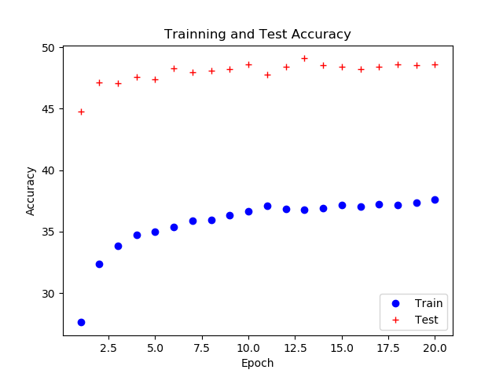
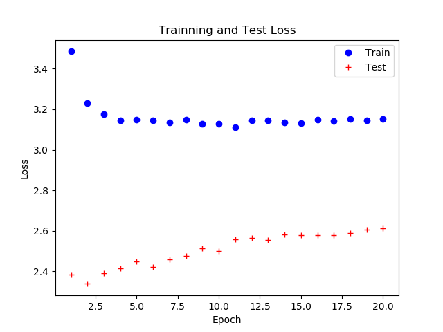

**Home Work \#6**

***Note:*** The script for running the train.py and test.py file is same
as described in the assignment instructions.

***Introduction***

In this homework transfer learning approach was adopted to train an
AlexNet for 200 different classes. The dataset used for this assignment
was a smaller variant of the ImageNet and pretrained AlexNet was
downloaded from the pytorch/vision. My own version of AlexNet model
(**new\_Net**) was defined and this model had only difference in the
last layer (4096 =&gt; 200 classes). Only the last layer of the new\_Net
was trained during this task and all the features are extracted using
the predefined net. The network is defined in the ‘**AlexNet.py**’ and
the training procedure was carried out by **‘train.py’** file. In
addition to the training ‘**train.py**’ also solves the best models
depending upon the validation accuracy. The ‘**dataloader.py**’ is
responsible for the preprocessing and arranging the data. As the Val
folder contains images randomly and their class labels are available in
the ‘val\_annotation.txt’ file, therefore the ‘**dataloader.py**’ used
the annotations to classify these images and arrange them in their
respective folders. Additionally, ‘**dataloader.py**’ was also
responsible for mapping the original alphanumeric folder names
(**n01443537**) to the specific class names (**Jelly fish**). The
‘**test.py**’ was responsible for loading the best model saved during
the training phase and fetching the frames from the webcam. The captured
frames from the webcam was then resized (**224 × 224**), converted to
the tensor and normalized. The converted tensor was then passed through
the pretrained model to classify the current frame and the class
prediction was displayed on the captured frame.

**Training Parameters:**

  Learning Rate      0.001
  ------------------ ---------------
  Number of Epochs   20
  Loss Function      Cross Entropy
  Train Batch        100
  Validation Batch   10
  Optimizer          SGD

***Time for executing the Forward pass: ***

Time for executing the one forward pass on the NVIDIA GTX 1080 Ti GPU
was around \~35 - 36 seconds with pretrained net used as fixed feature
extractor.

***Training and Validation Accuracy for 20 Epochs:***

Maximum (Best) Validation Accuracy = \~ 49%

{width="6.395833333333333in"
height="4.802083333333333in"}

***Training and Validation Loss for 20 Epochs:***

{width="6.395833333333333in"
height="4.802083333333333in"}
